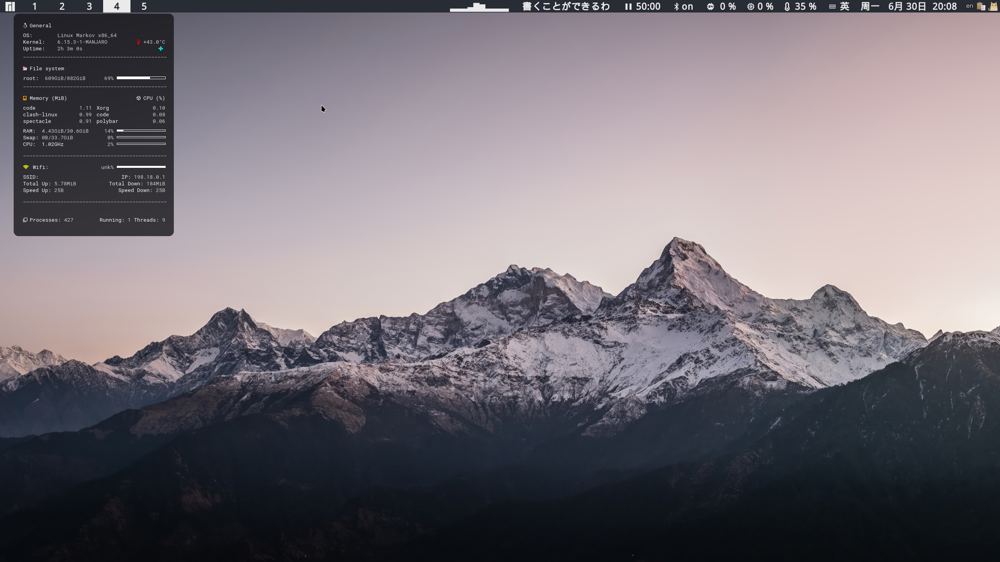
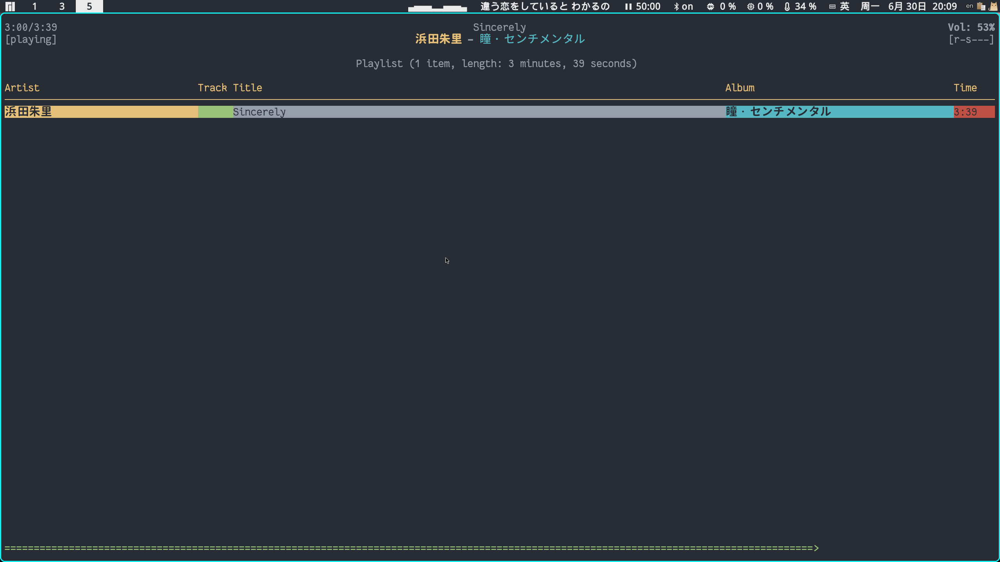
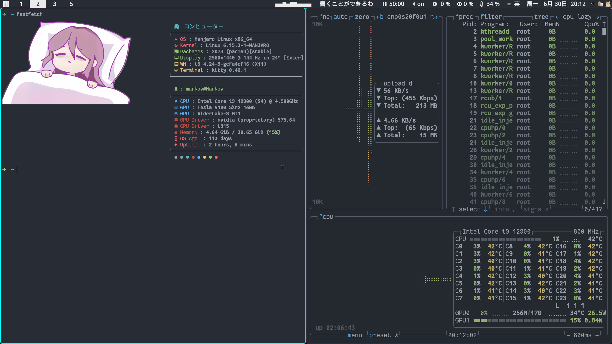
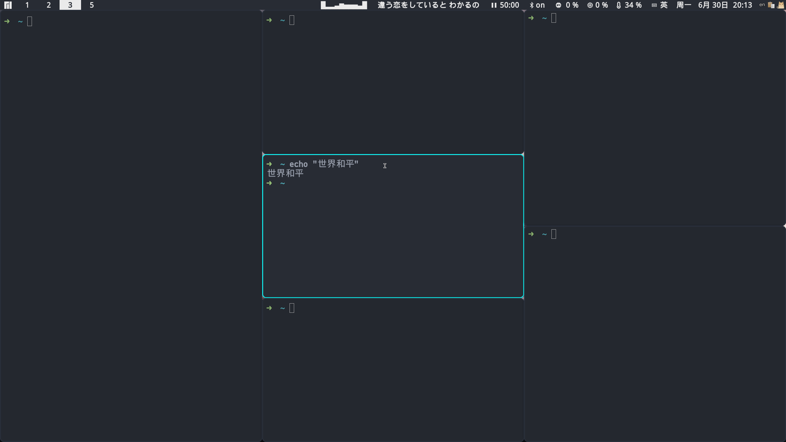
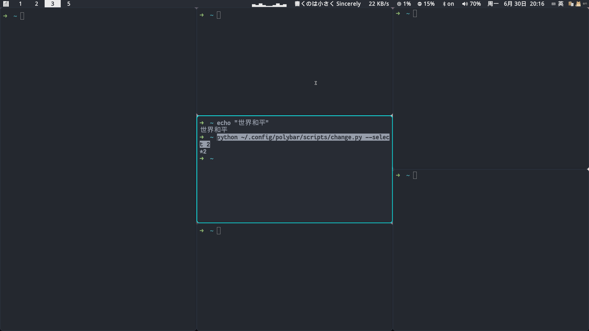
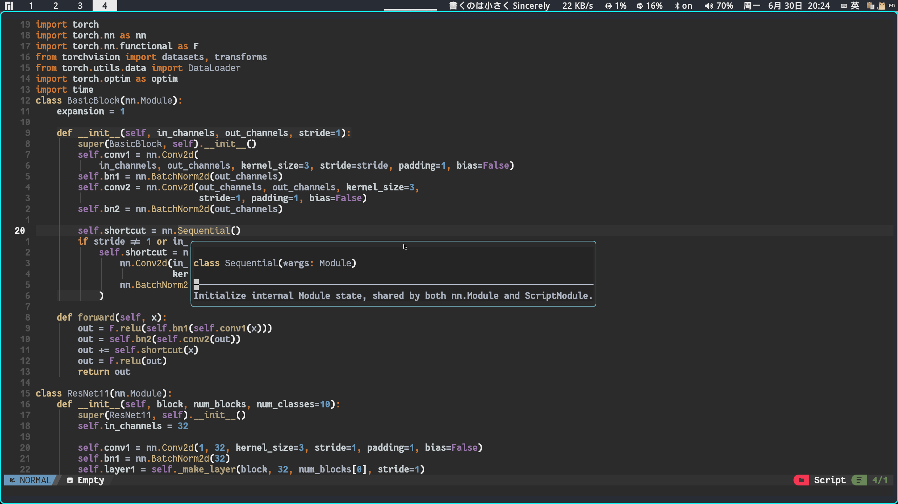

## README

I collect these from github. To make it more usable, I add some small tricky into it. 

This configuration work for i3-wm which uses the old X11 display protocol. It maybe not very fashion, but it's simple enough, both stable. 

Specially, [Nvchad](https://nvchad.com/ "Nvchad") provides a very solid and beautiful config for neovim. To have a consistent experience, I suggest you use OneDark theme in neovim.
But it's just a suggestion, after all, I use Dracula for myself.

And in this repo, conky is from [slate-conky-theme](https://github.com/CrispyKSP/slate-conky-theme "CrispyKSP").

Respect for all these great open-source projects.

## Preview



## Ncmpcpp



## Btop & Fastfetch



## Awesome Kitty !



## Different Polybar Combination

For examples, to activate #2 style which has a CPU monitor, just run `python ~/.config/polybar/scripts/change.py --select 2`, or edit your own config~.



## Customed Nvchad (Neovim)

Have a good look at the mappings.lua file, Combine qutebrowser to free your mouse and neck~ (Code hover keys I modified to 'F'.Press Shift-f twice to look up).
These lua config was written by Claude Code mostly.



## lighdm-slick-greater

Maybe you want it.

## macOS: yabai + skhd

`macos/` holds an i3-style tiling setup for macOS: yabai manages windows and skhd handles keys. There are ten numbered workspaces, one per macOS desktop.

Install on Apple Silicon:

```
git clone https://github.com/mejistus/fantastic-i3 ~/Documents/fantastic-i3
bash ~/Documents/fantastic-i3/macos/install.sh
```

The script is safe to rerun. It installs yabai, skhd, SketchyBar, jq and the fonts with Homebrew, links the configs into `~/.config` and builds the window switcher. It also turns off "Automatically rearrange Spaces based on most recent use", sets the macOS menu bar to auto-hide and starts the services. At the end it lists what's left to do by hand:

- Give yabai and skhd Accessibility access (System Settings → Privacy & Security → Accessibility), then rerun the script.
- Add desktops in Mission Control until there are 10.

The configs expect the repo at `~/Documents/fantastic-i3`. If you clone it somewhere else, the script creates that path as a link to your clone.

| Key | Action |
|---|---|
| ⌥1 … ⌥9, ⌥0 | Go to workspace 1 … 10 |
| ⌥B / ⌥T / ⌥Z / ⌥C, ⌥ + Caps Lock | Aliases for workspace 4 / 5 / 8 / 9, and 10. Caps Lock works on keyboards where it's remapped to 🌐/fn or left as Caps Lock |
| ⌥⇧1 … ⌥⇧0 | Move the window to that workspace and follow it |
| ⌃H / ⌃L | Previous / next workspace |
| ⌥H/J/K/L, ⌥⇧H/J/K/L | Focus / swap left, down, up, right |
| ⌥ + arrow, ⌥⇧ + arrow | Focus / swap by arrow keys. These replace the system's move/select-by-word shortcuts |
| ⌥F / ⌥⇧F | Fullscreen / toggle floating |
| ⌥- / ⌥= | Shrink / grow the window |
| ⌥⇥ | Window list, with the previous window selected (⌥⇥ then Return goes back to it). Type to search: keys go straight into the search box without passing through your input method, which stays as it was (Sogou keeps its own state and shortcuts). Chinese names match by pinyin, in full or by initials (天氣: `tianqi` or `tq`). Running apps without windows are listed at the end; picking one works like clicking it in the Dock |
| ⌘⇥ | Replaces the macOS app switcher. Tap: previous app. Hold ⌘: every app in Launchpad, one row each. Apps with windows come first (most recent first; picking one goes to its last-used window), then running apps without windows, then the rest by name; picking one that isn't running opens it |
| ⌘Space | Opens the ⌘⇥ app list straight away, instead of Spotlight. Press it again to close the list |
| ⌥R / ⌃S | Resize mode / service mode |
| ⌥D | Bring a Finder window to this workspace, or open one |
| ⌥G | Default browser on workspace 1: focus its window there, or switch to workspace 1 and open a new window |
| ⌥⇧⇥ | Move the workspace to the next monitor (needs the scripting addition) |

New windows of a few apps go to a fixed workspace: Microsoft Edge to 1 (tiled), iTerm2, kitty and Terminal to 5, WeChat to 10. Other apps open on the current workspace. When you open a new window of one of these apps from elsewhere (from the Dock, for example), you follow it to its workspace. Edge also takes you to its window when you activate it from the Dock or a link, even though macOS's "switch to a Space with open windows for the application" is off. Picking one of these apps in the ⌥⇥, ⌘⇥ or ⌘Space list switches to its workspace before opening it.

The macOS menu bar is replaced by a SketchyBar top bar styled like the i3 polybar (One Dark, Maple Mono NF). It is as tall as the menu bar (24 pt) and frosted like it. Move the mouse to the top edge to reach the real menu bar.

- Left: an  menu like the real one (About This Mac, System Settings, App Store, Sleep, Restart, Shut Down, Lock Screen, Log Out; restart / shut down / log out ask for confirmation first), workspaces 1 … 10 with the icons of the apps on each (click to switch), the skhd mode (RESIZE / SERVICE) and the focused app and window title.
- Right: a theme toggle (click to switch between colour and black-and-white icons; warnings stay yellow/red and the detail panels stay in colour), then system stats in the order GPU (Apple Silicon/MPS utilization) and CPU (each a graph and a percentage), memory, disk (used, counted like Finder), then network speed, input method (中/EN), volume (scroll to change), battery and date/time (formatted for the system locale, e.g. 10月7日 週三 13:55). Click any item on the right for a detail panel (click again or move away to close it). GPU and CPU show a larger history graph in blue; battery is green above 80 %, yellow from 30 % and red below; memory and disk show a usage bar and breakdown; CPU and memory list the top 5 processes (computed only while the panel is open); network shows IP, router and Wi-Fi signal/rate/channel; volume has a draggable slider for the current output device and a mute row; battery shows health, cycles and temperature; the clock shows the lunar date and week number. Click a panel's title (the ↗ on its right) to open the matching app or settings page. Scrolling on the volume item changes the volume. The bar sits above ordinary windows, so floating windows at the top of the screen can't cover it.

Config is in `macos/sketchybar/`. GPU, CPU, memory, disk, network, input method and the panel contents come from `aero-helper bar-stats` (`macos/yabai/helper/bar.swift`). The background is `aero-helper bar-backdrop` (`macos/yabai/helper/backdrop.swift`). Like the real menu bar, it shows the top of the wallpaper heavily blurred and slightly darkened, and windows behind it don't show through. It sits on the regular desktops only, so it slides in and out with them and never covers a native-fullscreen app (videos, slides). When a window covers a whole screen without native fullscreen, such as a PowerPoint slideshow, the bar and its background hide until it closes. SketchyBar's own `blur_radius` has no effect on macOS 15. macOS 15 hides the Wi-Fi name from apps without Location access, so the network item shows the connection type instead.

Without the scripting addition, workspaces switch with macOS's slide animation. Instant switching needs yabai's scripting addition, which requires partly disabling SIP. In Recovery, run `csrutil enable --without fs --without debug --without nvram`. Then run `macos/yabai/setup-sa`, and reboot if it asks. Run `setup-sa` again after every yabai upgrade. On macOS 15 it also patches yabai's loader so it can inject into the Dock ([yabai#2686](https://github.com/asmvik/yabai/issues/2686)).

To troubleshoot, run `macos/yabai/aero status`. Failed ⌥⇧N moves are logged to `/tmp/yabai-aero-$USER/aero.log`.

## Unified macOS Tahoe Dark Theme

GTK2/3/4 + Qt5/6 + fcitx5 + rofi unified to MacTahoe dark on i3/X11.
Details and apply steps: see [THEME.md](THEME.md) (`install.sh` installs the deps).

Bugs fixed along the way: stale xsettingsd broadcast overriding themes,
missing `MacTahoe-Dark` falling back to light Adwaita, KDE apps bypassing
qt6ct icons via kdeglobals, qt6ct custom palette covering Kvantum dark colors,
statically-linked Qt apps (WeChat) marked as unthemeable, plus a hybrid
fcitx5 `wechat-dark-menu` theme (WeChat panel + dark menus).

Theme config was corrected and bugs fixed with Muse Spark 1.3 Free and
DeepSeek 4.1 Flash.

Thanks to free software and free models.
