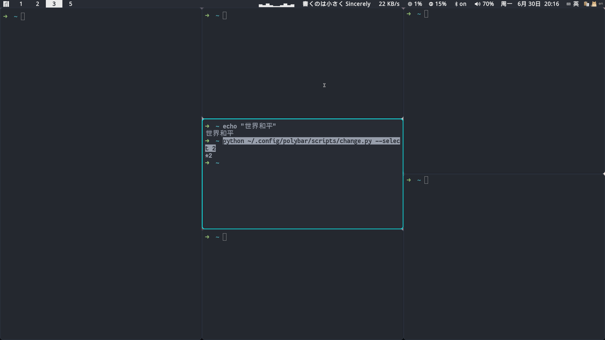

## README

I collect these from github. To make it more usable, I add some small tricky into it. 

This configuration work for i3-wm which uses the old X11 display protocol. It maybe not very fashion, but it's simple enough, both stable. 

Specially, [Nvchad](https://nvchad.com/ "Nvchad") provides a very solid and beautiful config for neovim. To have a consistent experience, I suggest you use OneDark theme in neovim.
But it's just a suggestion, after all, I use Dracula for myself.

And in this repo, conky is from [slate-conky-theme](https://github.com/CrispyKSP/slate-conky-theme "CrispyKSP").

Respect for all these great open-source project.

## Preview

## Ncmpcpp

## Btop & Fastfetch

## Awesome Kitty !

## Different Polybar Combination

For examples, to activate #2 style which has a CPU monitor, just run `python ~/.config/polybar/scripts/change.py --select 2`, or edit your own config~.

## Customed Nvchad (Neovim)

Have a good look at the mappings.lua file, Combine qutebrowser to free your mouse and neck~ (Code hover keys I modified to 'F'.Press Shift-f twice to look up).

## lighdm-slick-greater

Maybe you want it.
