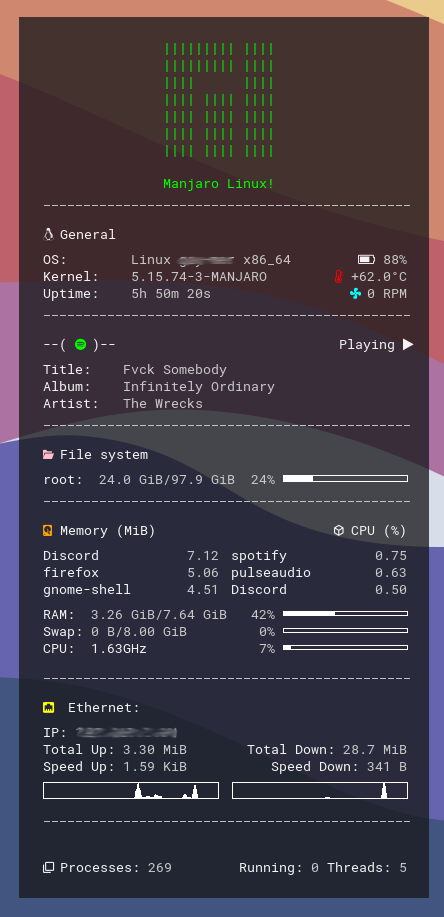

# slate-conky

a simpel conky config!

## install:
#### Debian/Ubuntu: 
`apt install conky`

#### Arch: 
`pacman -S conky`

#### Fedora: 
`dnf install conky` 


#### Setup
```shell
$ mkdir ~/.config/conky
$ mkdir ~/.fonts
$ cd ~/.config/conky
$ git clone https://github.com/TheDucky/slate-conky-theme.git
$ cp fonts/Roboto\ Mono\ Nerd\ Font\ Complete.ttf ~/.fonts
$ conky -c ~/.config/conky/slate-conky-theme/slate-conky.conf
``` 

#### Set conky as a startup application (automatically start on boot)
- create a new file `slate-conky.desktop` in `~/.config/autostart/`

```desktop
[Desktop Entry]
Exec=conky -c /home/$USER/config/conky/slate-conky-theme/slate-conky.conf
Name=slate-conky
Type=Application
```


#### special thinks to [AguilarLagunasArturo!](https://github.com/AguilarLagunasArturo)
